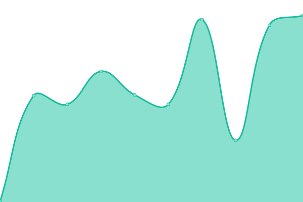

# [📈 Live Status](https://RitsuProject.github.io/themes-status): <!--live status--> **🟧 Partial outage**

This repository contains the open-source uptime monitor and status page for [Ritsu](https://ritsu.sazz.fail), powered by [Upptime](https://github.com/upptime/upptime).

With [Upptime](https://upptime.js.org), you can get your own unlimited and free uptime monitor and status page, powered entirely by a GitHub repository. We use [Issues](https://github.com/RitsuProject/themes-status/issues) as incident reports, [Actions](https://github.com/RitsuProject/themes-status/actions) as uptime monitors, and [Pages](https://RitsuProject.github.io/themes-status) for the status page.

<!--start: status pages-->
<!-- This summary is generated by Upptime (https://github.com/upptime/upptime) -->
<!-- Do not edit this manually, your changes will be overwritten -->
<!-- prettier-ignore -->
| URL | Status | History | Response Time | Uptime |
| --- | ------ | ------- | ------------- | ------ |
|  [AnimeThemes](https://animethemes.moe) | 🟩 Up | [anime-themes.yml](https://github.com/RitsuProject/ritsu-status/commits/HEAD/history/anime-themes.yml) | 

 196ms
     
 | 

<a href="https://status.sazz.fail/history/anime-themes">100.00%</a>
    

|  [AnimeThemes API](https://staging.animethemes.moe) | 🟩 Up | [anime-themes-api.yml](https://github.com/RitsuProject/ritsu-status/commits/HEAD/history/anime-themes-api.yml) | 

 217ms
     
 | 

<a href="https://status.sazz.fail/history/anime-themes-api">100.00%</a>
    

|  [Ritsu API](https://api.ritsu.fun/network) | 🟩 Up | [ritsu-api.yml](https://github.com/RitsuProject/ritsu-status/commits/HEAD/history/ritsu-api.yml) | 

 177ms
     
 | 

<a href="https://status.sazz.fail/history/ritsu-api">100.00%</a>
    

|  [Openings.moe](https://openings.moe/) | 🟩 Up | [openings-moe.yml](https://github.com/RitsuProject/ritsu-status/commits/HEAD/history/openings-moe.yml) | 

 468ms
     
 | 

<a href="https://status.sazz.fail/history/openings-moe">100.00%</a>
    

|  [Catbox](https://catbox.moe/) | 🟥 Down | [catbox.yml](https://github.com/RitsuProject/ritsu-status/commits/HEAD/history/catbox.yml) | 

 476ms
     
 | 

<a href="https://status.sazz.fail/history/catbox">99.82%</a>
    

<!--end: status pages-->

[**Visit our status website →**](https://RitsuProject.github.io/themes-status)

## 📄 License

- Code: [MIT](./LICENSE) © [Ritsu](https://ritsu.sazz.fail)
- Data in the `./history` directory: [Open Database License](https://opendatacommons.org/licenses/odbl/1-0/)
