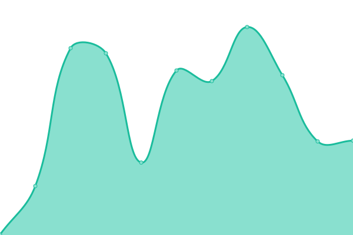
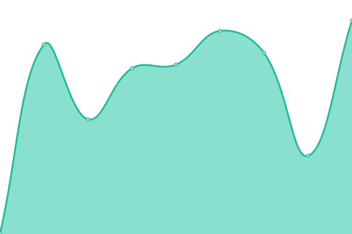
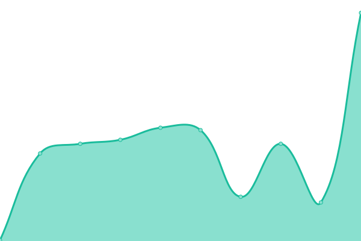

# [📈 Live Status](https://RitsuProject.github.io/themes-status): <!--live status--> **🟩 All systems operational**

This repository contains the open-source uptime monitor and status page for [Ritsu](https://ritsu.sazz.fail), powered by [Upptime](https://github.com/upptime/upptime).

With [Upptime](https://upptime.js.org), you can get your own unlimited and free uptime monitor and status page, powered entirely by a GitHub repository. We use [Issues](https://github.com/RitsuProject/themes-status/issues) as incident reports, [Actions](https://github.com/RitsuProject/themes-status/actions) as uptime monitors, and [Pages](https://RitsuProject.github.io/themes-status) for the status page.

<!--start: status pages-->
<!-- This summary is generated by Upptime (https://github.com/upptime/upptime) -->
<!-- Do not edit this manually, your changes will be overwritten -->

| URL                                        | Status | History                                                                                                          | Response Time                                                                         | Uptime                                                                                                                                                                                                                            |
| ------------------------------------------ | ------ | ---------------------------------------------------------------------------------------------------------------- | ------------------------------------------------------------------------------------- | --------------------------------------------------------------------------------------------------------------------------------------------------------------------------------------------------------------------------------- |
| [AnimeThemes](https://animethemes.moe)     | 🟩 Up  | [anime-themes.yml](https://github.com/RitsuProject/ritsu-status/commits/master/history/anime-themes.yml)         |  332ms     |          |
| [AnimeThemes API](https://animethemes.dev) | 🟩 Up  | [anime-themes-api.yml](https://github.com/RitsuProject/ritsu-status/commits/master/history/anime-themes-api.yml) |  428ms |  |
| [Ritsu API](http://ritsu.api.waiifu.tech)  | 🟩 Up  | [ritsu-api.yml](https://github.com/RitsuProject/ritsu-status/commits/master/history/ritsu-api.yml)               |  96ms         |                 |
| [Openings.moe](https://openings.moe/)      | 🟩 Up  | [openings-moe.yml](https://github.com/RitsuProject/ritsu-status/commits/master/history/openings-moe.yml)         |  525ms     |          |
| [Catbox](https://catbox.moe/)              | 🟩 Up  | [catbox.yml](https://github.com/RitsuProject/ritsu-status/commits/master/history/catbox.yml)                     |  684ms           |                       |

<!--end: status pages-->

[**Visit our status website →**](https://RitsuProject.github.io/themes-status)

## 📄 License

- Code: [MIT](./LICENSE) © [Ritsu](https://ritsu.sazz.fail)
- Data in the `./history` directory: [Open Database License](https://opendatacommons.org/licenses/odbl/1-0/)
